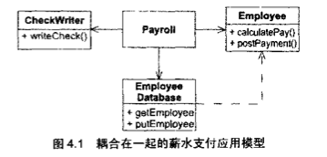
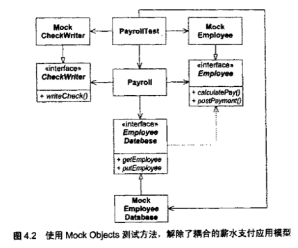

# 敏捷软件开发

## 敏捷实践
### 敏捷思想
 - 个体和沟通胜过过程和工具
 - 可以工作的软件胜过面面俱到的文档
 - 客户合作胜过合同谈判
 - 响应变化胜过遵循计划

### 极限编程
1. 客户作为团队成员
2. 用户素材（详细的需求文档）
3. 短交付周期

## 测试驱动开发
### 测试促使模块之间隔离， 获得解耦合

## 重构
可用，可变化，可读。

> 代码(饭)是要天天写的。忽略掉clean code的(清洁)工作并不能真正加快coding(做饭)的速度。

每个软件模块都具有三个职责：

 - 它运行起来所完成的功能
 - 它要应对的变化
 - 使其阅读者理解