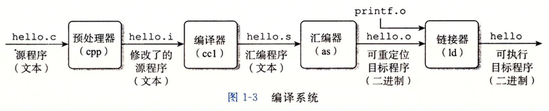
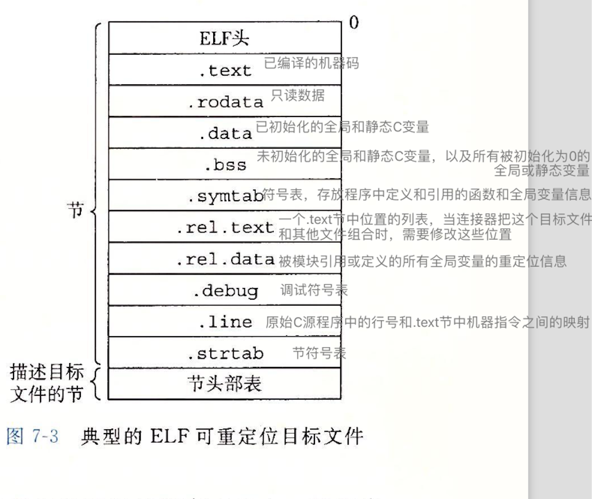

# 链接

链接是将各种代码和数据片段收集并组合成为一个单一 可执行的目标文件的过程。

本章所学的链接，指的是**ld**这个阶段，使用LD这样的静态链接器，将hello.o（等一组可重定位目标文件和命令行参数）"链接"成一个可以加载和运行的可执行目标文件。

## 二、目标文件
 
### 2.1 可重定位目标文件

ELF头剩下的部分包含帮助链接器语法分析和解释目标文件的信息。

头的大小、目标文件类型（如可重定位、可执行或共享的）、机器类型（如x86-64）、节头部表（section header table）的文件偏移，以及节头部表中条目的大小和数量。

不同节的位置和大小是由节头部表描述的，其中目标文件中每个节都有一个固定大小的条目（entry）。
 
### 2.2 可执行目标文件
包含二进制代码和数据，可以被直接复制到内存并执行。
### 2.3 共享目标文件
一种特殊类型的可重定位目标文件，可以在加载或者运行时被动态地加载近内存并链接。

## 符号和符号表
每个可重定位目标模块x都有一个符号表，它包含x定义和引用的符号的信息，在链接器的上下文中有三种不同的符号：

1. 由模块m定义并能被其他模块引用的全局符号。全局链接器符号对应于非静态的函数和全局变量。
2. 由其他模块定义并被模块m引用的全局符号。这些符号被称为外部符号，对应于在其他模块中定义的非静态函数和全局变量。
3. 只被模块m定义和引用的局部符号。它们对应于带static属性的函数和全局变量。这些符号在模块m中任何位置都可见，但不能被其他模块引用。

