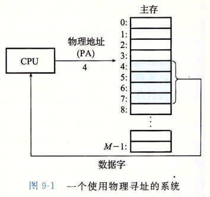
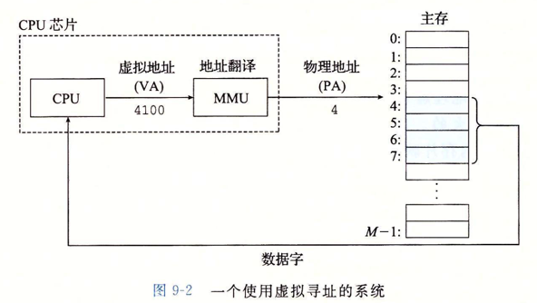
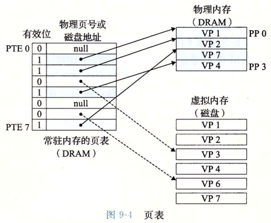

# 虚拟内存

虚拟内存三个重要的能力：

1. 它将主存看成是一个存储在磁盘上的地址空间的高速【缓存】。在主存中只保存活动区域，并根据需要在磁盘和主存之间来回传送数据，通过这种方式，高效使用主存。
2. 为每一个进程提供一致的地址空间，从而简化了【内存管理】。
3. 它【保护】了每个进程的地址空间不被破坏

从物理寻址到虚拟寻址：

## 页表
同缓存一样，虚拟内存系统必须有某种方法来判定一个虚拟页是否缓存在DRAM(主存)中，如果是，系统还需要确定这个虚拟页放在哪个物理页中，如果不命中，系统还必须判断这个虚拟页放在磁盘的那个地方，物理内存中选择某一个牺牲页，并将虚拟页从磁盘复制到DRAM中，替换这个牺牲页。这些功能是软硬件联合提供的，包括操作系统软件，MMU的地址翻译硬件和一个存放在物理内存中叫做页表的数据结构。

