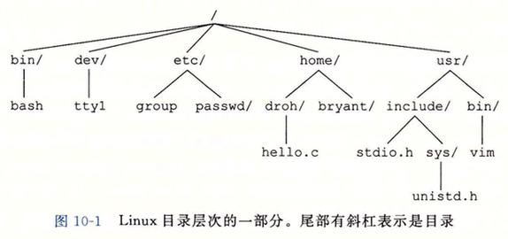

# 系统I/O
输入/输出(I/O)是在主存和外部设备(例如磁盘驱动器、终端和网络)之间复制数据的过程。输人操作是从I/O设备复制数据到主存，而输出操作是从主存复制数据到I/O设备。

## 文件
每个Linux文件都有一个类型(type)来表明它在系统中的角色:
- 普通文件(regular file)包含任意数据。应用程序常常要区分文本文件(text file)和二进制文件(binary file)，文本文件是只含有ASCII或Unicode字符的普通文件;二进制文件是所有其他的文件。对内核而言， 文本文件和二进制文件没有区别。
Linux文本文件包含了一个文本行(text line)序列，其中每一行都是一个字符序列，以一个新行符(\n)结束。新行符与ASCII的换行符(LF)是一样的，其数字值为0x0a.
- 目录(directory)是包含一组链接(link)的文件，其中每个链接都将一个文件名(filename)映射到一个文件，这个文件可能是另一个目录。每个目录至少含有两个条目:"."是到该目录自身的链接，以及".."是到目 录层次结构中父目录(parent directory)的链接。
套接字(socket)是用来与另一个进程进行跨网络通信的文件。

其他文件类型包含命名通道(named pipe)、符号链接(symbolic link)，以及字符和块设备(character and block device)。 
Linux内核将所有文件都组织成一个目录层次结构(directory hierarchy)，由名为/(斜杠)的根目录确定。系统中的每个文件都是根目录的直接或间接的后代。
作为其上下文的一部分，每个进程都有一个当前工作目录(current working directory)来确定其在目录层次结构中的当前位置。你可以用cd命令来修改shell中的当前工作目录。




## I/O重定向
Linux shell提供了I/O重定向操作符，允许用户将磁盘文件和标准输人输出联系起来。

> ls>foo.txt

使得shell加载和执行is程序，将标准输出重定向到磁盘文件foo.txt。

## 标准I/O

C语言定义了一组高级输人输出函数，称为标准I/O库，为程序员提供了Unix I/0的较高级别的替代。这个库(libc)提供了打开和关闭文件的函数(fopen和fclose)、读和写字节 的函数(fread和fwrite)、读和写字符串的函数(fgets和fputs)，以及复杂的格式化的I/O函数(scanf和printf)。
标准I/O库将一个打开的文件模型化为一个流。对于程序员而言，一个流就是一个指向FILE类型的结构的指针。每个ANSI C程序开始时都有三个打开的流stdin,stdout和stderr， 分别对应于标准输人、标准输出和标准错误:
```
#include 
extern FILE *stdin; /*StandardStruct input (descriptor 0)*/
extern FILE *stdout; /*StandardStruct output (descriptor 1)*/
extern FILE *stderr; /*StandardStruct error (descriptor 2)*/
```
类型为FILE的流是对文件描述符和流缓冲区的抽象。流缓冲区的目的就是使开销较高的Linux I/O系统调用的数量尽可能得小。例如，假设我们有一个程序，它反复调用标准I/O的 getc函数，每次调用返回文件的下一个字符。当第一次调用getc时，库通过调用一次read函数来填充流缓冲区，然后将缓冲区中的第一个字节返回给应用程序。只要缓冲区中还有 未读的字节，接下来对getc的调用就能直接从流缓冲区得到服务。

## 小结
Linux提供了少量的基于Unix I/O模型的系统级函数.它们允许应用程序打开、关闭、读和写文件，提取文件的元数据，以及执行I/ O重定向。Linux的读和写操作会出现不足值， 应用程序必须能正确地预计和处理这种情况。应用程序不应直接调用Unix I/O函数，而应该使用RIO包，RIO包通过反复执行读写操作，直到传送完所有的请求数据，自动处理不 足值。
Linux内核使用三个相关的数据结构来表示打开的文件。描述符表中的表项指向打开文件表中的表项，而打开文件表中的表项又指向v-node表中的表项。每个进程都有它自己单独 的描述符表，而所有的进程共享同一个打开文件表和v-node表。理解这些结构的一般组成就能使我们清楚地理解文件共享和I/O重定向。
标准I/()库是基于Unix I/O实现的，并提供了一组强大的高级I/O例程。对于大多数应用程序而言，标准I/O更简单，是优于Unix I/O的选择。然而，因为对标准I/O和网络文件 的一些相互不兼容的限制，Unix I/O比之标准I/O更该适用于网络应用程序。