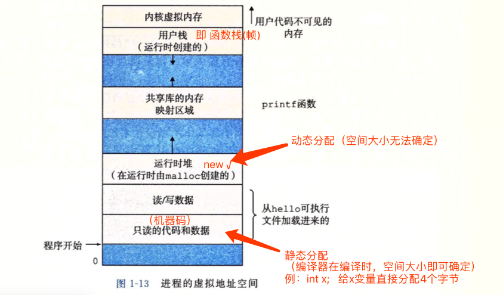
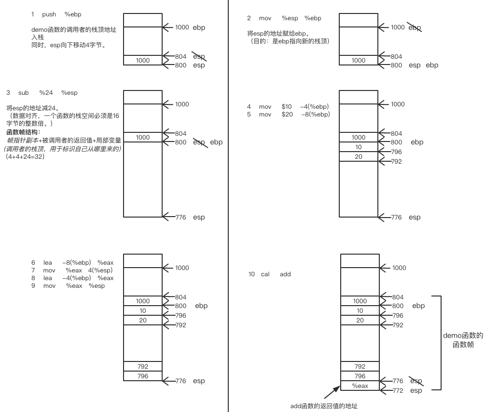
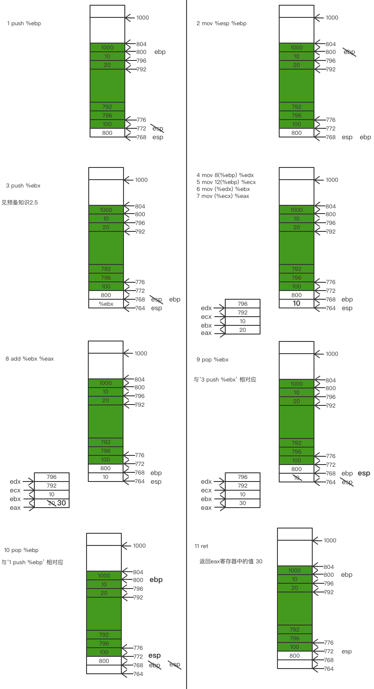

# 一个简单的x+y程序的机器级表示

## C语言代码：
```
int demo(){
    int x = 10;
    int y = 20;
    int sum = add(&x,  &y);
    printf(“the sum is %d\n”,sum);//假设这条指令的地址为100
    return sum;
}

int add(int *xp, int *yp){
    int x = *xp;
    int y = *yp;
    return x+y;
}
```

## 汇编代码：
```
demo:
1    push    %ebp
2    mov     %esp   %ebp
3    sub     %24    %esp
4    mov     $10    -4(%ebp)
5    mov     $20    -8(%ebp)
6    lea     -8(%ebp)   %eax
7    mov     %eax   4(%esp)
8    lea     -4(%ebp)   %eax
9    mov     %eax   %esp
10   cal     add
11   打印结果(略)

add:
1    push    %ebp
2    mov     %esp   %ebp
3    push    %ebx
4    mov     8(%ebp)    %edx
5    mov     12(%ebp)   %ecx
6    mov     (%edx)     %ebx
7    mov     (%ecx)     %eax
8    add      %ebx      %eax
9    pop     %eax
10   pop     %ebp
11   ret
```

## 汇编代码解析：
### 预备知识 
### 1. 进程的虚拟地址空间


### 2.了解寄存器
 - 一般寄存器
    1. AX(accumulator register) 累加寄存器（AH: AX寄存器的高8位，AL: AX寄存器的低8位）
    2. BX(base register) 基址寄存器
    3. CX(counter register) 计数寄存器
    4. DX(data register) 数据寄存器
 - 索引寄存器
    1. SI(source index) 来源索引寄存器
    2. DI(destination index) 目的索引寄存器
 - 指针寄存器
    1. **ebp**：(extended base pointer) 基址指针寄存器（**指向栈底**）
    2. **esp**：(extended stack pointer) 栈指针寄存器（**指向栈顶**）

e:(extended) 代表32位寄存器，占4个字节。
### 3. 几个概念
 - %esp: 【代表对当前esp(指针寄存器)的值的引用】
 - 问：如何判断内存/寄存器中存的是值还是地址？  
   答：寄存器中既可以存储一个数据值，也可以存储某一个指针的地址。看你mov进去的是什么。

### 4. 栈地址的生长方向：高地址-->低地址
所以栈顶位于低地址

### 5. 一些编程的约定：因为寄存器是所有程序的共享资源，但一个特定的时刻，只能被一个程序(函数)使用。
为保证程序A调用程序B时，程序B不会覆盖程序A寄存器的值。  
AX,CX,DX，寄存器的值，需要调用者（程序A）来保存。  
BX  是被调用者来保存的。

## 图解汇编
### 假设
1. 在执行demo函数之前，（调用demo函数的主函数的ebp的地址为1000）
2. esp，当前的指向的地址为804
3. call add函数的下一句代码的内存的位置 地址为100
### demo函数：


### add函数


