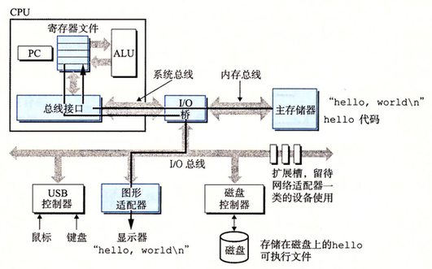
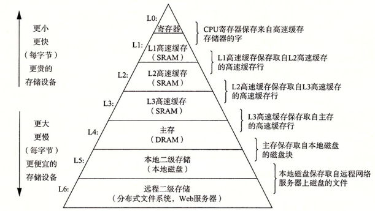

## 一个hello.c程序的前世今生

```
#include<stdio.h>
int main() {
    printf("hello, world\n");
    return 0;
}
```
> gcc -o hello hello.c

预处理->编译->汇编->链接
> ./hello

shell程序将字符读入寄存器，在放到内存。-- 敲击回车 --  
->shell加载hello文件(1)  
->处理器执行main程序中的机器语言指令。（将数据从主存复制到寄存器(2)）  
->将数据输出到显示器上。（将数据从寄存器复制到显示设备）

(1): 代码和数据("hello,world\n"这个字符串)从磁盘复制到主存  
(2): 寄存器，一种高速缓存，通过`静态随机访问存储器(SRAM)`的硬件技术实现



## 存储设备的层次结构



| 存储器 | 单字节访问时间(相对) | 容量(相对)(数量级) | 容量(相对)(语言)(相对) |
| :------: | ------: | ------: | :------ |
| 寄存器 | 1 | 100 | 几百字节 |
| L1高速缓存 | 1 | 10 000|数万字节 |
| L2高速缓存 | 5 | 100 000 - 1 000 000|数十万 - 数百万字节 |
| 主存 | 100 | 1 000 000 000|数十亿万字节 |
| 本地磁盘 | 1 000 000 000 | 1 000 000 000 000|数十亿万字节 x 1000 |


## Amdahl's law（阿姆达尔定律）
计算机系统的一种短板效应

加速比 S = T_old / T_new  
α：可优化部分的比重 [0,1]  
k：该部分性能提升的比例

即：
  

由此可见，当k -> ∞，S的大小取决于优化部分占总体的比重。

决定系统性能的关键因素有那么几点：内存资源、CPU资源、磁盘I/O，那么系统的总体性能是取决于当前最慢的磁盘I/O速度，而不是内存和CPU。这种情况下，只有提高磁盘I/O速度才能对系统的整体性能进行优化。我觉得这一点跟木桶的短板效应很像。