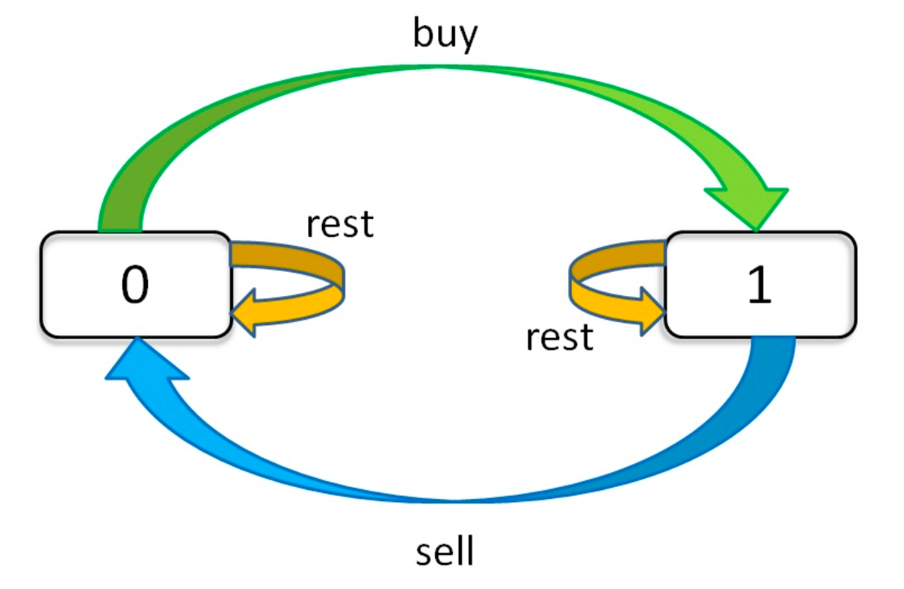

dp[i][k][0 or 1]:  第 i 天，进行了 k 次交易，所获得的最大收益。  
0 <= i <= n-1, 1 <= k <= K  
n 为天数，大 K 为最多交易数  
此问题共 n × K × 2 种状态，全部穷举就能搞定。



dp[i][k][0] = max(dp[i-1][k][0], dp[i-1][k][1] + price[i]);  
第 i 天，未持有股票 = max(第 i-1 天本来就没有股票, 第 i-1 天把股票卖了)

dp[i][k][1] = max(dp[i-1][k][1], dp[i-1][k-1][0] - price[i]);
第 i 天，持有股票 = max(第 i-1 天本来就持有股票，第 i-1 天买了股票)

**注意 k 的限制，买入股票 就记为1次交易。因为dp[i][0][0] == 0**

```java
base case:  
dp[-1][k][0] = dp[i][0][0] = 0          //因为 k 是从 1 开始的，所以 k = 0 意味着根本不允许交易，这时候利润当然是 0
dp[-1][k][1] = dp[i][0][1] = -infinity  //不允许交易的情况下，是不可能持有股票的，用负无穷表示这种不可能。

```
### [E121_买卖股票的最佳时机](../code100/E121_买卖股票的最佳时机.java)
最多只允许完成一笔交易（即买入和卖出一支股票一次）  

k = 1  
```java   
dp[i][1][0] = max(dp[i-1][1][0], dp[i-1][1][1] + price[i]);  
dp[i][1][1] = max(dp[i-1][1][1], dp[i-1][0][0] - price[i]);  
            = max(dp[i-1][1][1], -price[i]);

==>  
dp[i][0] = max(dp[i-1][0], dp[i-1][1] + price[i]);  
dp[i][1] = max(dp[i-1][1], dp[i-1][0] - price[i]);  
            = max(dp[i-1][1], -price[i]);
            

base case:           
dp[0][0] = 0;
dp[0][1] = -price[i];       

return dp[n-1][0];           
```

### [E122_买卖股票的最佳时机2](../code100/E122_买卖股票的最佳时机2.java)
尽可能地完成更多的交易（多次买卖一支股票）  

k = +infinity
```java   
  
dp[i][k][0] = max(dp[i-1][k][0], dp[i-1][k][1] + price[i]);  
dp[i][k][1] = max(dp[i-1][k][1], dp[i-1][k-1][0] - price[i]);  
            = max(dp[i-1][k][1], dp[i-1][k][0] - price[i]); // k == 正无穷  

==>  
dp[i][0] = max(dp[i-1][0], dp[i-1][1] + price[i]);  
dp[i][1] = max(dp[i-1][1], dp[i-1][0] - price[i])

base case:           
dp[0][0] = 0;
dp[0][1] = -price[i];       

return dp[n-1][0];
```

### [H123_买卖股票的最佳时机3](../code100/H123_买卖股票的最佳时机3.java)
最多可以完成 两笔 交易  
不能同时参与多笔交易（你必须在再次购买前出售掉之前的股票）。  
k <= 2

maxK = 2;

```java

for (int i = 0; i < n; i++) {
    for (int k = maxK; k >= 1; k--) {
        dp[i][k][0] = max(dp[i-1][k][0], dp[i-1][k][1] + price[i]);  
        dp[i][k][1] = max(dp[i-1][k][1], dp[i-1][k-1][0] - price[i]);
    }
}

base case:           
dp[0][1][0] = 0;
dp[0][2][0] = 0;
dp[0][1][1] = -prices[0];
dp[0][2][1] = -prices[0];
```

### [H188_买卖股票的最佳时机4](../code100/H188_买卖股票的最佳时机4.java)
最多可以完成 k 笔交易  
不能同时参与多笔交易（你必须在再次购买前出售掉之前的股票）。

k  

同上.  
maxK = k
```java    
dp[i][k][0] = max(dp[i-1][k][0], dp[i-1][k][1] + price[i]);  
dp[i][k][1] = max(dp[i-1][k][1], dp[i-1][k-1][0] - price[i]);

base case:
    for (int k = maxK; k >= 0; k--) {
        dp[0][k][0] = 0;
        dp[0][k][1] = -prices[0];
    }

优化：
    // k > n / 2，相当于 k == +infinity
    if (k > n / 2) {  
        return maxProfix_k_infinity(prices);
    }   
```


### [M309_最佳买卖股票时机含冷冻期](../code300/M309_最佳买卖股票时机含冷冻期.java)
在满足以下约束条件下，你可以尽可能地完成更多的交易（多次买卖一支股票）:

 - 你不能同时参与多笔交易（你必须在再次购买前出售掉之前的股票）。
 - 卖出股票后，你无法在第二天买入股票 (即冷冻期为 1 天)。

k = +infinity  
因为 买入之后可以在第二天卖出，卖出后不能在第二天买入。  
所以 要新增一个状态：（卖出之后的那一天 既不能买也不能买）hold状态
```java
dp[i][k][0] = max(dp[i-1][k][0], dp[i-1][k][1] + price[i]);  
dp[i][k][1] = max(dp[i-1][k][1], dp[i-2][k-1][0] - price[i]);  
            = max(dp[i-1][k][1], dp[i-2][k][0] - price[i]); // k == 正无穷
dp[i][k][2] = dp[i-1][k][1] + price[i-1]; 

==>  
dp[i][0] = max(dp[i-1][0], dp[i-1][2]);    // 今天未持有股票：max(昨天本来就没有，前天卖了)
dp[i][1] = max(dp[i-1][1], dp[i-1][0] - price[i]);    // 今天持有股票：max(昨天本来就有，前天买的)
dp[i][2] = dp[i-1][1] + price[i];

base case:
dp[0][0] = 0;
dp[0][1] = -prices[0];
dp[0][2] = Integer.MIN_VALUE;

return max(dp[n-1][0], dp[n-1][2]);
```
### [M714_买卖股票的最佳时机含手续费](../code700/M714_买卖股票的最佳时机含手续费.java)
你可以无限次地完成交易，但是你每笔交易都需要付手续费 fee。
如果你已经购买了一个股票，在卖出它之前你就不能再继续购买股票了。

k = +infinity  
```java
dp[i][k][0] = max(dp[i-1][k][0], dp[i-1][k][1] + price[i] - fee);  
dp[i][k][1] = max(dp[i-1][k][1], dp[i-2][k-1][0] - price[i]);  
            = max(dp[i-1][k][1], dp[i-2][k][0] - price[i]); // k == 正无穷  

==>  
dp[i][0] = max(dp[i-1][0], dp[i-1][1] + price[i] - fee);  
dp[i][1] = max(dp[i-1][1], dp[i-2][0] - price[i])

base case:           
dp[0][0] = 0;
dp[0][1] = -price[i];       

return max(dp[n-1][0], dp[n-1][1]);
```