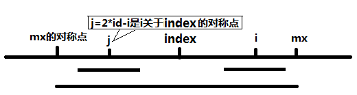

左神直播地址：[https://www.nowcoder.com/live/2/4/1](https://www.nowcoder.com/live/2/4/1)

# 题目： 给定一个字符串，求它的最长回文子串长度。

## 1. 暴力出奇迹
求出字符串n的所有字串（O(N^2)），然后判断每个字符串是否为回文串（O(N)）。
    时间复杂度：O(N^3)
    
## 2. 根据回文串都是对称的特性
分别以每个字符串（奇数个字符）或者两个字符串中间的位置（偶数个字符），向两边扩，直到无法再扩，记下长度。因为这样的位置一共有（2N+1）个，每个位置上平均要进行N/4次字符的比较，所以此算法的时间复杂度为：O(N^2)
    
## 3. Manacher算法
1. 消除奇偶性问题
    在每个字符的两边加一个同样的特殊字符，（可以是'#'、也可以是'a'，对最终计算结果无影响。）

        例：    
            aba  ———>  #a#b#a#
            abba ———>  #a#b#b#a#

2. 解决一定程度上的重复访问问题
    （马拉车算法的精髓：三个辅助变量：）
     - pArr[i]：i位置上，所能扩到的最大回文半径
     - maxRight：记录回文半径所能扫到最右位置。（maxRight = i+pArr[i]-1）
     - index：当maxRight更新的时候，此时回文中心的位置

    **Manacher算法的核心：利用回文串的对称性，高效的扩展pArr[]。**
    
    1. 当计算到i位置（且i在maxRight的左边）时，j为i关于index的对称位置，所以分为两种情况：
        a. pArr[j]很短，短到像下图这样：
        
        
        
        所以以i为对称轴的回文串的回文半径至少为pArr[j]，因此可以将pArr[j]赋给pArr[i]，然后从i+pArr[i]的位置继续扩展
        
        b. 以j为对称轴的回文串很长，这么长：
        
        
        
        这时 我们只能确定以i为轴时，绿框里面的部分（即不超过maxRight部分）是回文的，于是我们就可以将maxRight-i赋给pArr[i]，从i+pArr[i]位置继续扩展
        
    2. i在maxRight的右边，此时以i为对称轴的字符串还没有任何部分别访问过，所以只能从i的左右两边开始尝试扩展了，然后更新maxRight和index
    
    代码：
    
```

/**
 * 求 最长回文字串的长度
 * Created by nibnait on 2016/9/18.
 */
public class Manacher {

    public static void main(String[] args) {
//        String str = "tattarrattat";
        String str = "cabaddabac";
        System.out.println(maxLcpsLength(str));
    }

    private static int maxLcpsLength(String str) {
        if (str==null || str.length()==0){
            return 0;
        }
        char[] strArr = str.toCharArray();
        int length = 2*strArr.length+1;
        char[] charArr = new char[length];
        charArr[length-1] = '#';
        //字符串预处理
        int cnt = 0;
        for (int i = 0; i < length-1; ) {
            charArr[i++] = '#';
            charArr[i++] = strArr[cnt++];
        }
        int MaxLen = Integer.MIN_VALUE;
        int[] pArr = new int[length];   //i位置上，所能扩到的最大回文半径
        int maxRight = -1;      //记录回文半径所能扫到最右位置。（maxRight = i+pArr[i]-1）
        int index  = -1;        //当maxRight更新的时候，此时回文中心的位置
        for (int i = 0; i < length; i++) {
            if (i < maxRight){
                pArr[i] = Math.min(pArr[2*index-i], maxRight-i);    //看pArr[j]的长度
            } else {
                pArr[i] = 1;    //i在maxRight的右边，从1开始扩
            }
            //尝试扩展
            while (i+pArr[i]<length && i-pArr[i]>=0 && charArr[i-pArr[i]]==charArr[i+pArr[i]]){
                pArr[i]++;
            }
            //尝试更新maxRight和index
            if (i+pArr[i]>maxRight){
                maxRight = i+pArr[i]-1;
                index = i;
            }
            MaxLen = Math.max(MaxLen, pArr[i]);
        }
        return MaxLen-1;    //因为MaxLen为带有'#'的回文半径，所以不带'#'回文长度也就为MaxLen-1
    }

}

```
          
          
# 进阶题目：请在一个字符串最后添加最少字符，使整个字符串都成为回文串
其实就是查找在必须包含最后一个字符的情况下，最长的回文串是什么。那么将之前不是最长回文字串的部分逆序过来，就是应该添加的部分了。

例如："abcd123321", 在必须包含最后一个字符的情况下，最长回文字串是"123321"，之前不是回文子串的部分是"abcd"，所以末尾应该添加的部分就是"dcba"。

则可将Manacher算法修改成：当maxRight到达最后时，直接退出，然后返回不包含最后那段回文字串的所有前面的字符串的逆序即可。


    
