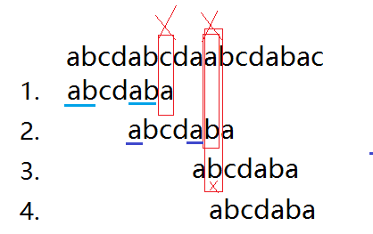

左神直播地址：[https://www.nowcoder.com/live/2/5/1](https://www.nowcoder.com/live/2/5/1)

# 题目：给定字符串str1 和str2，请返回str2 在str1 中第一次出现的位置；如果str1 不包含str2，返回-1 

## 1. 暴力解法
从str1[0]位置开始与str2[0]一个一个匹配，一步一步往下走。
    str1的长度为N，str2的长度为M，
    则时间复杂度为：O（N*M）
    
## 2. KMP算法
由于暴力算法，做了很多重复的匹配工作，比如str1="aaaaaaaaaaaaaaab"，str2="aaaaaaaab"时，暴力算法简直累死傻小子啊
为了尽可能少的进行重复的无意义的比较，下面引入一个nextArr[]
### KMP算法的精髓：nextArr[i]

    int nextArr[i]中放的是str2的i位置处，不包含i位置的这个字符，只考察i位置前面的字符串：前缀和后缀相同时的最大长度
    
        前缀：从第一个字符开始向后扩，不包含最后一个字符
        后缀：从最后一个字符向前扩，不包含第一个字符

#### 举个栗子：
    str2: aaaab
                a  a  a  a  b
    nextArr[]{ -1, 0, 1, 2, 3}
    nextArr[0]: 它之前没有字符，∴ 规定nextArr[0] = -1;
    nextArr[1]: 因为前缀不包含最后一个字符，后缀不包含第一个字符，∴ nextArr[1] = 0;
    nextArr[2]: 考察的字符串："aa", 前缀: "a", 后缀: "a", 前缀后缀相同时的最大长度:1, ∴ nextArr[2] = 1; 
    nextArr[3]: 考察的字符串："aaa", 前缀: "aa", 后缀: "aa", 前缀后缀相同时的最大长度:2, ∴ nextArr[3] = 2; 
    nextArr[4]: 考察的字符串："aaaa", 前缀: "aaa", 后缀: "aaa", 前缀后缀相同时的最大长度:3, ∴ nextArr[4] = 3; 
    
    str2: 123123b
               1  2  3  1  2  3  b
    nextArr[]{-1, 0, 0, 0, 0, 0, 3}
    nextArr[0] = -1;    
    nextArr[1] = 0;    
    nextArr[2]: 考察的字符串："12", 前缀: "1", 后缀: "2", 前缀后缀相同时的最大长度:0, ∴ nextArr[2] = 0;    
    nextArr[3]: 考察的字符串："123", 前缀: "12", 后缀: "23", 前缀后缀相同时的最大长度:0, ∴ nextArr[3] = 0;    
    nextArr[4]: 考察的字符串："1231", 相同前缀: "1", 相同后缀: "1", 前缀后缀相同时的最大长度:1, ∴ nextArr[4] = 1;    
    nextArr[5]: 考察的字符串："12312", 相同前缀: "12", 相同后缀: "12", 前缀后缀相同时的最大长度:2, ∴ nextArr[5] = 2;    
    nextArr[6]: 考察的字符串："123123", 相同前缀: "123", 相同后缀: "123", 前缀后缀相同时的最大长度:3, ∴ nextArr[6] = 3;    


### 下面采用一个典型例子，讲解一下KMP算法的流程：
    
    str1="abcdabcdaabcdabac"
    str2="abcdaba"
    nextArr[]{-1, 0, 0, 0, 0, 1, 2}
    
1. 挨个字符串比较，当第一次出现不匹配时：str2可以一次性向右移动4位（'a'为str2的第6号元素，nextArr[6]=2，所以向右移动6-2=4位）。【因为str2的'a'位置前面的字符串，相同最长字符的后缀（"ab"）前面的那些字符就不用检查了，必然匹配不出来。】
2. 第二次出现不匹配时，一样，'b'前面的那个后缀'a'前面的字符都不用比了，直接将str2再向后移动4位（'b'是str2的第5号字符，又因为nextArr[5]=1，所以向后移动5-1=4位）从a位置处开始往后比较。
3. str2的'b'与str1的'a'不匹配，向右移动1位，重新比较。
4. bingo！ Game Over！return str1中那个'a'的下标。
图示：



### 下面介绍nextArr[]的求法：
 - 对于str2[0]来说，在它之前没有字符，所以规定nextArr[0] = -1;
 - 因为前缀不包含最后一个字符，后缀不能包含第一个字符，所以 nextArr[1] = 0;
 - 当i>1时，就需要动笔算了：
    引入一个cn变量：最长匹配前缀后面那个字符的位置。

    - 当遍历到i时，将str2[i-1]与str2[cn]相比较，如果相等，则正好nextArr[i]=nextArr[i-1]+1.
    - 如果不相等，则比较str2[nextArr[cn]]与str2[i-1]，直到cn到达str2[0]的位置。如果还是不与str2[i-1]相等，则nextArr[i] = 0;

代码：

```
    private static int[] getNextArray(char[] s2) {
        if (s2.length == 1){
            return new int[]{-1};
        }
        int[] nextArr = new int[s2.length];
        nextArr[0] = -1;
        nextArr[1] = 0;
        int pos = 2;    //当前位置
        int cn = 0;     //最长匹配前缀的下一个字符的位置
        while (pos < s2.length){
            if (s2[pos-1] == s2[cn]){   
                nextArr[pos++] = nextArr[pos-1] + 1;
            }else if (cn > 0){
                cn = nextArr[cn];
            }else {
                nextArr[pos++] = 0;
            }
        }
        return nextArr;
    }

```

完整代码：[./KMP.java](./KMP.java)

时间复杂度分析：因为将str2遍历一遍即可求得nextArr[]
所以整个KMP算法的时间复杂度即为：O(M)（str2的长度M）+O(N)（匹配过程）,因为N>=M，所以时间复杂度为O(N)。


#扩展题目：给定两棵二叉树的头结点head1 和head2，判断head2 是不是head1 的子树  

将二叉树遍历成字符串咯。

---

再回过头看用KMP查找"aaaaaaaab"在"aaaaaaaaaaaaaaab"中第一次出现的位置：
