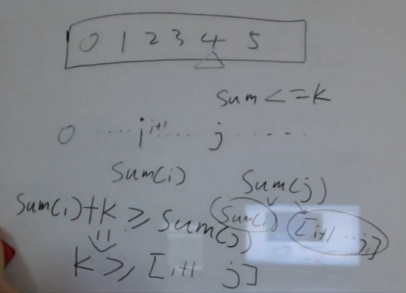
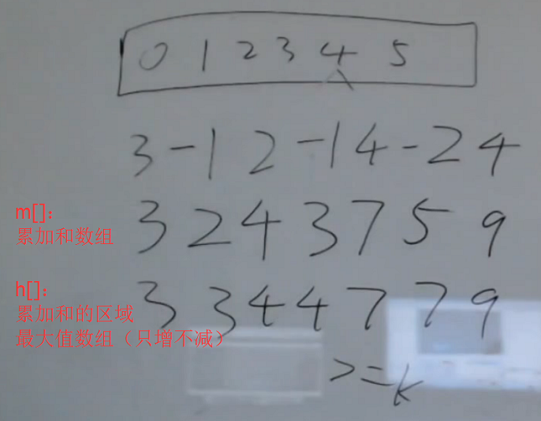

课程回顾：[http://www.Algorithm.algorithm_practice.nowcoder.com/live/11/2/1](http://www.nowcoder.com/live/11/2/1)
课件下载：[https://pan.baidu.com/s/1kVRhQi7](https://pan.baidu.com/s/1kVRhQi7)

## 1.求两个子数组最大的累加和
【题目】
给定一个数组，其中当然有很多的子数组，在所有两个子数组的组合中，找到相
加和最大的一组，要求两个子数组无重合的部分。最后返回累加和。
【要求】
时间复杂度达到O(N)

    做法：
        cur 依次累加各个元素，一旦cur为负数时，则将cur清为零。
        并尝试更新一次result（最大值）
        最终返回result即为子数组的最大累加和

    解释：
        因为最大和的子数组：其任意数量的前缀一定不为负。
        也就是 cur如果没有累加出到负数，就继续往下走。   即模拟了“前缀不可能为负数”的情况。

    至于两个子数组：
        无非就是将arr分成两部分，分别求出左右两边的最大子数组和，然后再相加。
         - 求左部分的maxSubArray时，正常求
         - 求右部分时，先用一个Rmax[]遍历一遍数组
         这样时间复杂度即可做到2* O(N).


## 2.未排序正数数组中累加和为给定值的最长子数组长度
【题目】
给定一个数组arr，该数组无序，但每个值均为正数，再给定一个正数k。求arr
的所有子数组中所有元素相加和为k 的最长子数组长度。
例如，arr=[1,2,1,1,1]，k=3。
累加和为3 的最长子数组为[1,1,1]，所以结果返回3。
【要求】
时间复杂度O(N)，额外空间复杂度O(1)

    自然想法：（暴力出奇迹）
         - 找出所有子数组中相加和为k的，再找出长度最长的。
         时间复杂度：O(N^2)
         
    要求时间复杂度 O（N）
        继续使用双指针，
        1. L、R都指向arr[0]，
           sum：记录L和R之间的元素和
           len：记录L到R的最大距离
        2. R开始向右移动
            while(R< arr.length){
                sum<k时，R++
                sum>=k时，L++
                更新记录len
            }
    这样只遍历了一次arr，时间复杂度为O(N)，
       只声明了几个辅助变量，额外空间复杂度为O(1)。
            

## 3.未排序数组中累加和为给定值的最长子数组系列问题
【题目】
给定一个无序数组arr，其中元素可正、可负、可0，给定一个整数k。求arr
所有的子数组中累加和为k 的最长子数组长度。
【补充题目】
给定一个无序数组arr，其中元素可正、可负、可0。求arr 所有的子数组中正
数与负数个数相等的最长子数组长度。
【补充题目】
给定一个无序数组arr，其中元素只是1 或0。求arr 所有的子数组中0 和1 个
数相等的最长子数组长度。
【要求】
时间复杂度O(N)

    算法原型：
        sum[i]：arr[0,,,,i]的累加和
        如果存在：sum[i] + k = sum[j] （i在j的左边），则说明：arr[i+1,,,,j]=k
        考察，从j位置 往左最多能扩多远？
        即：sum[j]-k最早出现的位置。。

        
        提示：
        可以用HashMap， 
            key：sum，
            value：这个key最早出现在数组中的位置。
    
    【正数与负数个数相等】
        把正数变为1，负数变为-1.再求累加和==0的最长子数组
    
    【下一个】
        把0变成-1


## 4.未排序数组中累加和小于或等于给定值的最长子数组长度
【题目】
给定一个无序数组arr，其中元素可正、可负、可0，给定一个整数k。求arr
所有的子数组中累加和小于或等于k 的最长子数组长度。
例如：arr=[3,-2,-4,0,6]，k=-2，相加和小于或等于-2 的最长子数组为
{3,-2,-4,0}，所以结果返回4。
【要求】
时间复杂度(N*logN)

    时间复杂度(N*logN)
    只要求出 最早 >=sum[j]-k出现的位置
    即：出现了>=5的累加和，就无需关心>=3的累加和了。
        arr， 
        m[]：每一步的累加和数组。
        h[]：辅助数组，每个位置，累加和递增的序列。（累加和数组中，从0到i位置范围上的 累加和数组的最大值）

        
    求第一个 >=k的位置，
    用二分。
   
```

    分析：这个问题和前一篇的问题很像，区别在于本题是小于或等于的。那么我们是否能用前面的解法来解这道题呢？之前的解法我们把sum-k用哈希表存储起来，我们用O(1)的时间复杂度可以判断sum-k是否在哈希表中。本题我们要存的是值要大于sum-k，它是一个不定值，我们需要遍历查找，时间复杂度达到O(N)，整体达到O(N*N)。如何能达到时间复杂度(N*logN)呢？看到logN我们直接想到的就是二分，使用二分的前提条件是有序，事情似乎有点眉目了。
    
    解法：我们需要一个辅助数组h（进行保存的时候保存的是某位置前面的累加和的最大值），显然这个数组是非递减的，我们就可以使用二分来查找。我们遍历原数组，在h数组中查找第一个大于或等于sum-k的数的位置，这个位置到当前位置元素的累加和一定是小于或等于k的当前最长子数组，也就是说当前子数组的值为sum，找到的位置前面累加是大于或等于sum-k的，后面的累加和就是小于或等于k的，也就是我们要的部分，然后看看这个长度是否是当前最长的，若是就记录下来，若不是继续遍历。整个过程我们遍历了一遍，查找用二分，整体时间复杂度为(N*logN)。
    
```