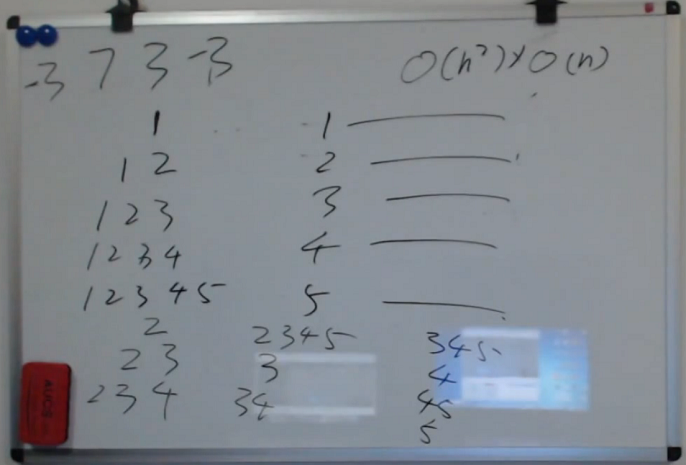
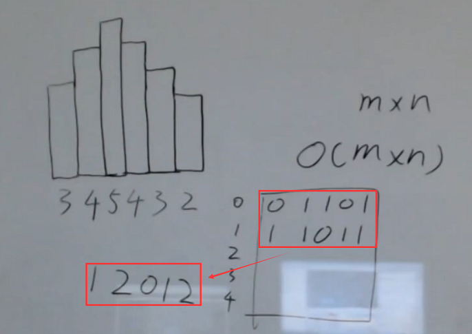
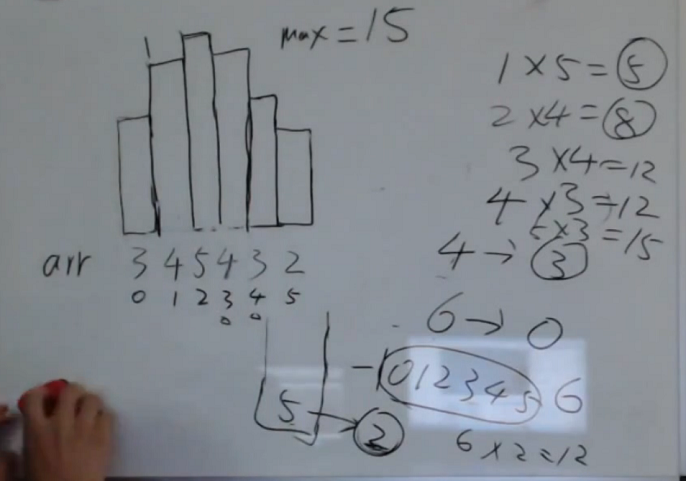

课程回顾：[http://www.Algorithm.algorithm_practice.nowcoder.com/live/11/3/1](http://www.nowcoder.com/live/11/3/1)
课件下载：[https://pan.baidu.com/s/1bo0JTZx](https://pan.baidu.com/s/1bo0JTZx)

## 1.给定一个无序矩阵，其中有正，有负，有0，求子矩阵的最大和。

    暴力解法：
        O(N^2)个点可以作为子矩阵左上角
        每个子矩阵有O(N^2)个点  ==> 所以一共有O(N^4)种子矩阵
        求子矩阵所有元素的累加和 时间复杂度：O(N^2)
        ==> 此题暴力解法的时间复杂度：O(N^6)
        
    左神解法：
        转化为了上节课求子数组最大和的问题
        
        时间复杂度：O(N^2 *N)

        
        
代码：[./src/SubMatrixMaxSum.java](./src/SubMatrixMaxSum.java)

## 2.给定一个无序矩阵，其中有正，有负，有0，再给定一个值k，求累加和小于等于k 的最
大子矩阵大小，矩阵的大小用其中的元素个数来表示。

    只需找到累加和<=k 的最长子数组的长度即可
 
    一共有N行，以这些行为首行的子矩阵有N*N个，
    求数组中累加和小于或等于给定值的最长子数组长度的时间复杂度为O(N*logN)，
    整体的时间复杂度为O(N^3*logN)
    
代码：[./src/MaxSubMatrixSumLessK.java](./src/MaxSubMatrixSumLessK.java)

## 3.给定一个无序矩阵，其中只有1 和0 两种值，求只含有1 的最大的子矩阵大小，矩阵的大
小用其中的元素个数来表示。

    如果矩阵是m*n的，则时间复杂度可以做到O(M*N)
   
    将矩阵转化为直方图。然后求直方图内最大的长方形的面积即可。
     
    
    用栈：
         - 当前数 > 栈顶，index直接入栈
         - 当前数 < 栈顶，比较, 计算max， 弹栈， 当前数的index入栈
         - 当前数 = 栈顶，
     
     
代码：[./src/MaximalRectangle.java](./src/MaximalRectangle.java)
    
    
## 4.给定一棵完全二叉树的头结点head，求其中的结点个数。

    满二叉树高度是L，则结点数：2^L - 1。
    完全二叉树：
        难点，不知道最底层到哪了。
    解题： 
     - 先遍历最左边那的结点，看看到了多少层（深度）
     - 再遍历到整个右子树的 最左结点，看看有没有
         - 如果有，则整个左子树是满的，结点数：2^(L-1) - 1;   ==>Recursion
         - 如果没有， root的右子树的结点数：2^(L-2) -1 
             -  ==>Recursion
     
     整个的时间复杂度：O( (logN)^2) = O((logN + logN)^2)
    
代码：[./src/CompleteTreeNodeNumber.java](./src/CompleteTreeNodeNumber.java)    
    

## 5.给定一个字符串类型的数组，其中不含有重复的字符串，
如果其中某一个字符串是另一个字符串的前缀，返回true；如果没有任何一个字符串是另一个字符串的前缀，返回false。

    最长前缀树（N叉树的数据结构，缺谁补谁）
        
代码：[./src/PrefixCheck.java](./src/PrefixCheck.java)
    