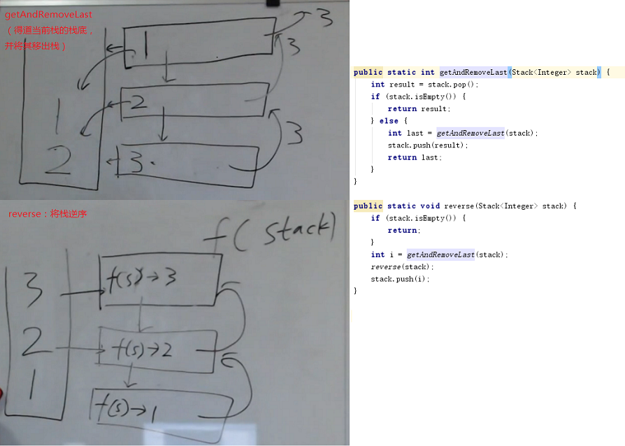

课程回顾：[http://www.Algorithm.algorithm_practice.nowcoder.com/live/11/4/1](http://www.nowcoder.com/live/11/4/1)
课件下载：[http://pan.baidu.com/s/1kVrWOrt](http://pan.baidu.com/s/1kVrWOrt)

## 题目一 设计一个有getMin 功能的栈
【题目】
实现一个特殊的栈，在实现栈的基本功能的基础上，再实现返回栈中最小元素的
操作。

【要求】
1．peek、pop、push、getMin 操作的时间复杂度都是O(1)。
2．设计的栈类型可以使用现成的栈结构。

    要想O(1)，只能再加一个help辅助栈。（空间换时间）
代码：[./src/GetMinStack.java](./src/GetMinStack.java)    

## 题目二 由两个栈组成的队列
【题目】
编写一个类，用两个栈实现队列，支持队列的基本操作（add、poll、peek）。

        
代码：[./src/TwoStacksImplementQueue.java](./src/TwoStacksImplementQueue.java)

## 题目三 由两个队列组成的栈
【题目】
编写一个类，用两个队列实现栈，支持栈的基本操作（push、poll、peek）。

代码：[./src/TwoQueuesImplementStack.java](./src/TwoQueuesImplementStack.java)

## 题目四 如何仅用递归函数和栈操作逆序一个栈
【题目】
一个栈依次压入1、2、3、4、5，那么从栈顶到栈底分别为5、4、3、2、1。将
这个栈转置后，从栈顶到栈底为1、2、3、4、5，也就是实现栈中元素的逆序，
但是只能用递归函数来实现，不能用其他数据结构。

    【此题就是为了递归而设计的】
        需要辅助结构（递归自带：栈）
    递归过程：

代码：[./src/ReverseStackUsingRecursive.java](./src/ReverseStackUsingRecursive.java)

## 题目五 字符串表达式求值
【题目】
给定一个字符串str，str 表示一个表达式，其中只可能有整数、加减乘除符号
和左右括号，返回公式的计算结果。

【举例】
str="48*((70-65)-43)+8*1"，返回-1816。  
str="3+1*4"，返回7。  
str="3+(1*4)"，返回7。  

【说明】
1．可以认为给定的字符串一定是正确的表达式，即不需要对str 做公式有效性
检查。
2．如果是负数，就需要用括号括起来，比如"4*(-3)"。但如果负数作为公式的
开头或括号部分的开头，则可以没有括号，比如"-3*4"和"(-3*4)"都是合法的。
3．不用考虑计算过程中会发生溢出的情况。

    自然想法：
        逆波兰表达式（用栈）

    左神解法：（用递归代替栈，）
         - 简单表达式求值
         - 将“（”、“）”里面的字符串理解成另一个表达式，递归求解。
         - 如何返回两个值：装在一个二维数组中。[0]的位置放数组，[1]的位置放其在原表达式中的下标
        
    
代码：[./src/ExpressionCompute.java](./src/ExpressionCompute.java)

## 题目六 生成窗口最大值数组
【题目】
有一个整型数组arr 和一个大小为w 的窗口从数组的最左边滑到最右边，窗口每
次向右边滑一个位置。

    例如，数组为[4,3,5,4,3,3,6,7]，窗口大小为3 时：
    [4 3 5] 4 3 3 6 7 窗口中最大值为5
    4 [3 5 4] 3 3 6 7 窗口中最大值为5
    4 3 [5 4 3] 3 6 7 窗口中最大值为5
    4 3 5 [4 3 3] 6 7 窗口中最大值为4
    4 3 5 4 [3 3 6] 7 窗口中最大值为6
    4 3 5 4 3 [3 6 7] 窗口中最大值为7
如果数组长度为n，窗口大小为w，则一共产生n-w+1 个窗口的最大值。

请实现一个函数。  
输入：整型数组arr，窗口大小为w。  
输出：一个长度为n-w+1 的数组res，res[i]表示每一种窗口状态下的最大值。  
以本题为例，结果应该返回{5,5,5,4,6,7}。  

    算法原型：O(n)
         双端队列：存的是数组的下标 
         

代码：[./src/SlidingWindowMaxArray.java](./src/SlidingWindowMaxArray.java)