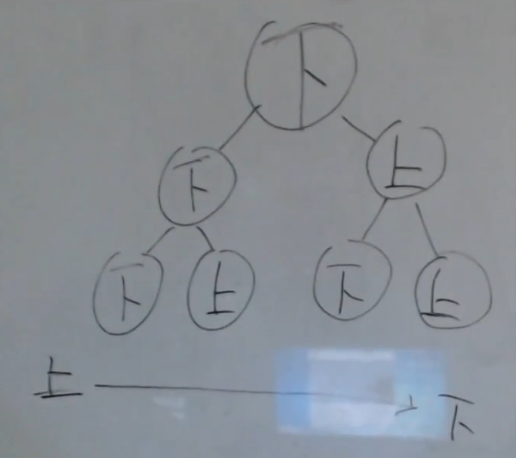
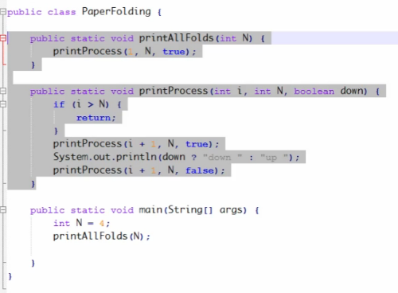
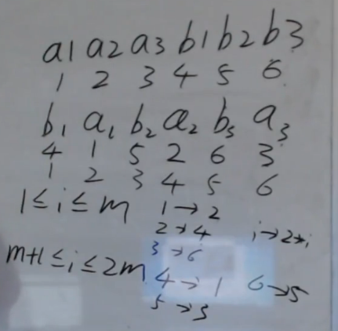

## 题目一：折纸问题
【题目】  
请把一段纸条竖着放在桌子上，然后从纸条的下边向上方对折1次，压出折痕后展开。此时折痕是凹下去的，即折痕突起的方向指向纸条的背面。如果从纸条的下边向上方连续对折2次，压出折痕后展开，此时有三条折痕，从上到下依次是下折痕、下折痕和上折痕。给定一个输入参数N，代表纸条没次都从下边向上方连续对折N次，请从上到下打印所有折痕的方向。

例如：N=1时，打印：  
down  
N=2时，打印：  
down   
down   
up   

解：这是一棵二叉树的中序遍历

    空间复杂度：O（N）
        有多少层，空间复杂度就是多少。即递归栈的深度。（二叉树的深度）

    

## 题目二：旋转字符串
【题目】  
给定一个字符类型的数组chas和一个整数size，请把大小为size的左半区整体移到右半区，右半区整体移到左边。

【举例】  
如果把chas看作字符串为"ABCDE"，size=3，调整成"DEABC"。

【要求】  
如果chas长度为N，两道题都要求时间复杂度为O(N)，额外空间复杂度为O(1)。

    法1：《剑指Offer》f42_2$左旋转字符串，两次Reverse
    法2：也是两次Reverse：
    12 3456
    56 34 12
    34 56 12
    
    1234 56
    56 34 12
    34 56 12
    
    12 345
    45 3 12
    3 45 12
    
    123 45
    45 3 12
    
    12345 67
    67 345 12   定 左 右 
       12 5 34  定 左 右
          4 3 5 左 右 定
    67 12 3 4 5 
    
    小块换过来的东西，定住！
    
    交换的次数对比：
        m代表size的大小，n代表字符串长度
        
        法1：m/2 + n/2 + (m+n)/2
        法2：（最差）m次
    

## 题目三：数组先小于等于再大于等于的调整
【题目】  
给定数组arr，请将数组调整成a <= b >= c <= d >= e <= f...的样子  
【举例】  
arr = {3,1,2}   
调整之后，arr可以是{1,3,2}. 1 <= 3 >=2  
调整之后，arr也可以是{2,3,1}. 2 <= 3 >=1  
 
arr = {3,1,2,6}  
调整之后，arr可以是{1,6,2,3}. 1 <= 6 >= 2 <= 3  
调整之后，arr也可以是{3,6,1,2}. 3 <= 6 >= 1 <= 2  
【要求】  
1，如果arr长度为N，要求时间复杂度为O(N * logN)，额外空间复杂度为O(1)。  
2，arr可能会不止一种调整方案，但只要满足要求即可。  

    
    123456 7
    456 123 7
    415263 7
    

## 题目四：在数组中找到第k小的数
【要求】  
如果arr长度为N，要求时间复杂度为O(N)，额外空间复杂度为O(1)。  

    《剑指Offer》e30_最小的k个数    法1：Partition的思想、法2：堆排的思想
    左神讲：bfprt算法
        1. 划组（比如说 5个数组）
        2. 组内排序
        3. N/5个中位数，组成一个小数组--> arr[2]（中位数）
        4. 以arr[2]为基准，partition
        5. 如果划分之后，基准值的下标和k比较，然后继续
            在基准值左边/右边从第一步开始递归。
    
    
    