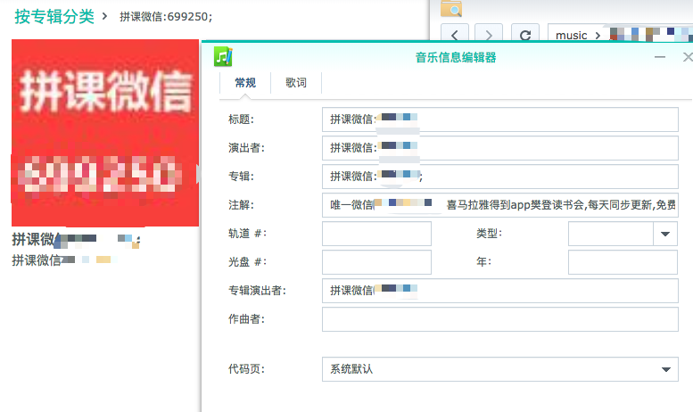
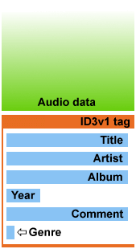
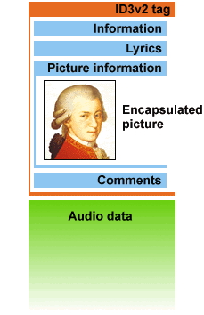

# 使用jid3批量修改mp3文件中的标题、演出者、专辑等信息
ID3全称是Identity of MP3，其解决方案是在音频文件末尾附加一串数据，包含关于歌曲的名称、歌手、图片的信息。

[TOC]

## 背景
买了几节网络音频节目，但是音频文件信息里面各种乱填，根本没法分类。

## 目标
批量：
 - 将元数据中album改成 当前文件夹名。
 - 将元数据中的title改成 本文件名。
 - 其他字段 全部为空。

## mp3文件的meta信息结构
参考资料：[https://www.cnblogs.com/cocowool/p/python_read_mp3_id3v1_tag.html](https://www.cnblogs.com/cocowool/p/python_read_mp3_id3v1_tag.html)
### ID3v1
ID3v1附着在音频数据之后，长度为128bytes，每个字段最大支持30个字符。

### ID3v1的文件结构
| 名称 | 字节 | 说明 |
| :------: | :------: | :------: |
| Tag | 3 | ID3V1标识符“TAG”的Ascii码 |
| Title | 30 | 歌曲名 |
| Artist | 30 | 歌手名 |
| Album | 30 | 专辑名 |
| Year | 4 | 日期信息 |
| Comment | 28 | 注释信息，有时为30字节 |
| Reserved | 1 | ＝0说明有音轨，下一字节就是音轨；≠0表示注释是30个字节 |
| Track | 1 | 音轨（字节型数值），歌曲在专辑里的序号 |
| Genre | 1 | 歌曲风格（字节型数值） |

### ID3v2
ID3v2是加在音频数据前面的一组数据，每项具体的数据称为frame(例如歌曲名称)。可以包含任意类型的数据，每个frame最大支持16MB，整个tag大小最大支持256MB。存储编码支持Unicode，这样就不会产生乱码问题。

Tag数据放在音频数据之前还有一个好处，对于流式访问可以首先获得歌曲信息并展现给用户

## 寻找想要修改的ID3v2对象字段
参考资料：
 - [ID3v2 中文文档ver2.3.0](https://blog.csdn.net/cheetah023/article/details/52119864)

例如，作曲者：  
根据文档查出  
>TCOM    作曲家

然后去`ID3v2_2.class`文件中全局搜索"TCOM"，即为ID3v2这个对象中作曲者的这个字段名

---
ID3v2_2.class中遇到的：

| 文本信息帧 | 解释 | 调用ID3v2对象使用的方法 |
| :------: | :------: | :------: |
| TENC | 编码 | xx |
| TIT2 | 歌名 | getSongTitle |
| TALB | 专辑名 | getAlbumTitle |
| TYER | 灌录年份 | xx |
| COMM | 注释，相当于ID3v1的Comment | getSongComment |
| TCON | 流派（风格）| getSongGenre |
| TRCK | 音轨号 | getTrackNumberOnAlbum |
| SYLT | 歌词 | getSongLyric |
| TDAT | 灌录日期 | xx |
| TIT1 | 内容组描述 | xx |
| APIC | 附加描述 | xx |
| TCOM | 作曲家 | getAuthorComposer |
| TPE1 | 艺术家相当于ID3v1的Artist | getLeadArtist |

## TODO
getID3的信息为乱码。。这个问题还未解决。。
瓶颈：获取不到原字符串的编码。

## 坑
不要以为在内存里把文件的meta信息修改完就完了。
还有最后一步，将Mp3File rewrite到磁盘上！

嗯，卡在了：Mp3File --> byte[]这一步。

## 放弃jid3lib，手撸ID3解析Util

正准备按照Test的方式手撸一管Util，问了一下孜然大佬 被推荐了[Mp3tag](https://www.mp3tag.de/en/)这个应用。

解决了。

周末研究一下这个APP！